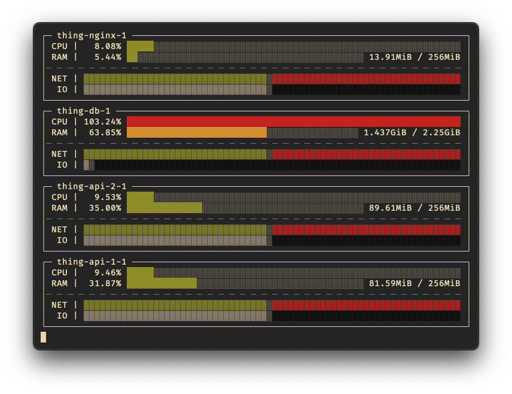

<div align="center">

# 📊 `ds` - A Terminal-Based Docker Stats Viewer

_Visualize container metrics with real-time charts directly in your terminal._

  
</div>

> [!IMPORTANT]
> `ds` is under active development. The `main` branch is intended to be stable, but breaking changes may occur.

## Overview

`ds` provides real-time monitoring of Docker container statistics, rendering them as charts in the terminal. It serves as a visual alternative to the standard `docker stats` command, making it easier to analyze resource utilization at a glance.

This project was inspired by the need for a visual statistics tool similar to Docker Desktop's, especially when using lighter container management solutions like [OrbStack](https://orbstack.dev/).

## Features

- **Real-Time charting**: Visualize CPU, memory, network, and I/O usage with dynamic charts.
- **Customizable Views**: Choose between compact and full layouts to control the level of detail.
- **Container Filtering**: Display statistics for all containers or specify a subset by name or ID.
- **Rust-Powered**: Built with Rust for performance and reliability.

## Installation

> [!NOTE]
> `ds` will be available on [crates.io](https://crates.io/) once it reaches a stable release.

### From Source

Ensure you have [Rust and Cargo](https://doc.rust-lang.org/cargo/getting-started/installation.html) installed.

1. Clone the repository:

   ```bash
   git clone https://github.com/rafaelrcamargo/ds
   cd ds
   ```

2. Build and install the binary:

   ```bash
   cargo install --path .
   ```

3. Run the application:

   ```bash
   ds
   ```

## Usage

The default command displays statistics for all running containers:

```bash
ds
```

To view all available options, run:

```bash
ds --help
```

### Examples

#### Compact View

For a minimal overview of all containers, use the compact flag:

```bash
ds -c
```

#### Detailed View for Specific Containers

To monitor specific containers with full details, including network and I/O charts, provide their names or IDs:

```bash
ds -f 5f03524a8fbe api-1
```

## Known Issues

<details open>
<summary>

### Slow Startup Time

</summary>

`ds` may experience a startup delay while it establishes a connection to the Docker daemon and begins receiving statistics. This behavior is inherent to how `docker stats` operates and is consistent with the performance of both OrbStack and Docker Desktop.

</details>

<details>
<summary>

### Network Chart Limitations

</summary>

The network chart does not display data for containers running in `network_mode: host`. Metrics will only be populated for containers using the `bridge` network. This is a known limitation related to how Docker exposes network statistics.

For more context on `network_mode: host` on macOS, see the discussion in the [Docker roadmap](https://github.com/docker/roadmap/issues/238).

</details>

## Contributing

Contributions are welcome! If you have suggestions or find a bug, please [open an issue](https://github.com/rafaelrcamargo/ds/issues) or submit a pull request.

## License

This project is licensed under the [Apache License 2.0](LICENSE).
