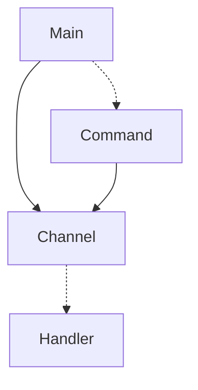

1. The main starts a new Channel, and then the Command listening on the stdout.

1. The Command will send new events to the Channel, and the Channel will send the events to the
Handler.

1. The handler will then process the events and send the result to the stdout. While keeping a timer to check if the Container is alive, any 2+ seconds without a new event will kill the remaining Containers.
